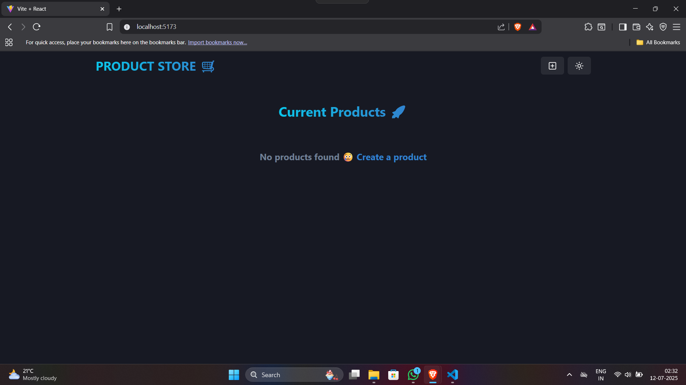
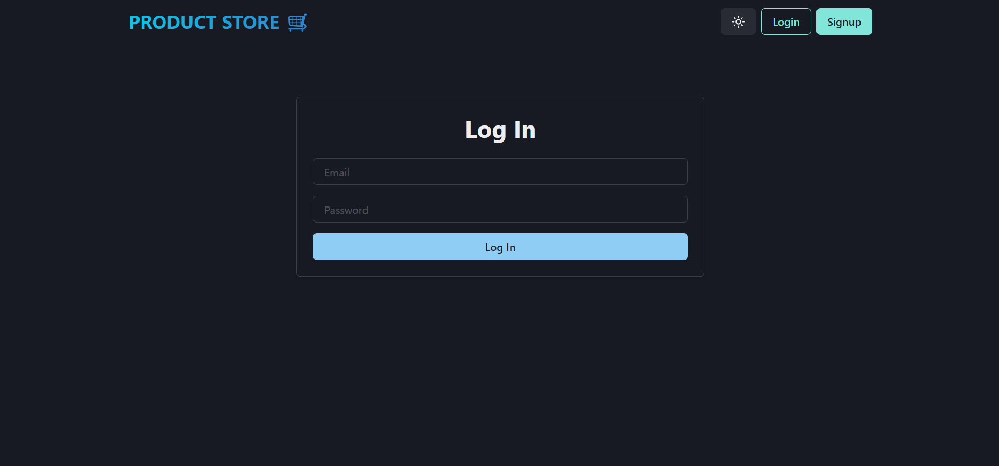
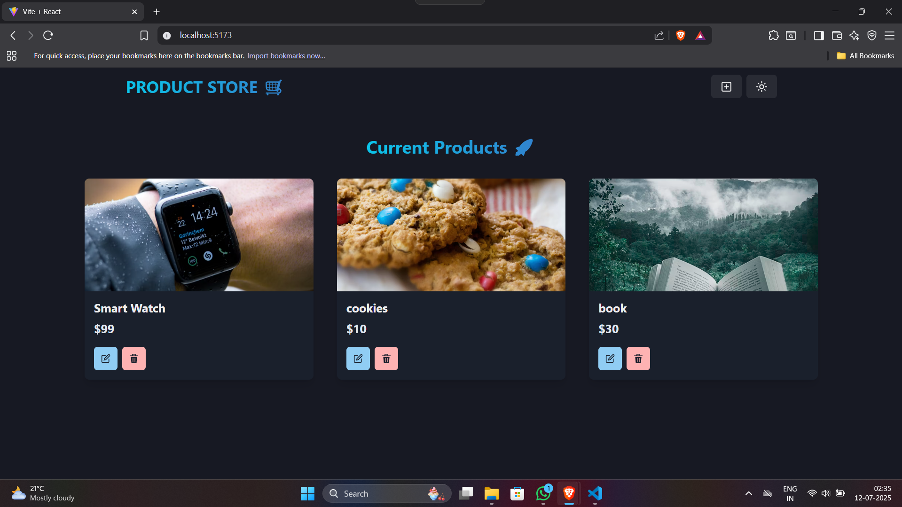
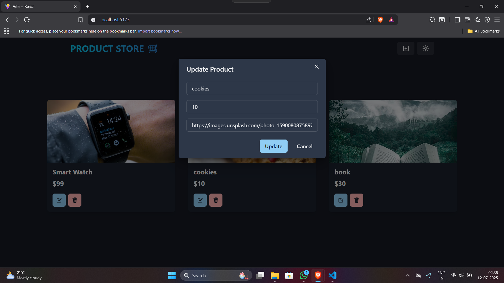

# 🛍️ Product Store App

A simple full-stack product management application built with:

- **Frontend**: React + Vite + Chakra UI
- **Backend**: Node.js + Express
- **API Proxy**: Vite server proxy for smooth frontend-backend connection

---

## 🚀 Features

- Add new products
- View all products
- Update or delete products
- Full JSON API backend
- Frontend & backend connected using Vite proxy

---

## 📦 Tech Stack

| Layer      | Tech                |
|------------|---------------------|
| Frontend   | React, Vite, Chakra UI |
| Backend    | Node.js, Express    |
| Styling    | Chakra UI |
| Package Manager | npm             |

---
## 📸 Screenshots

