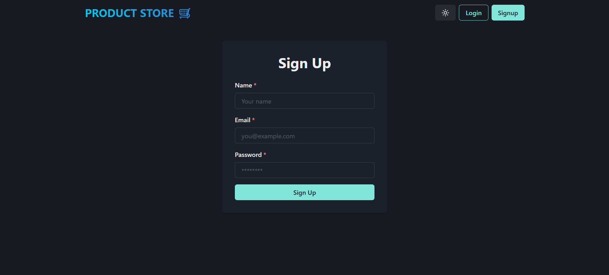
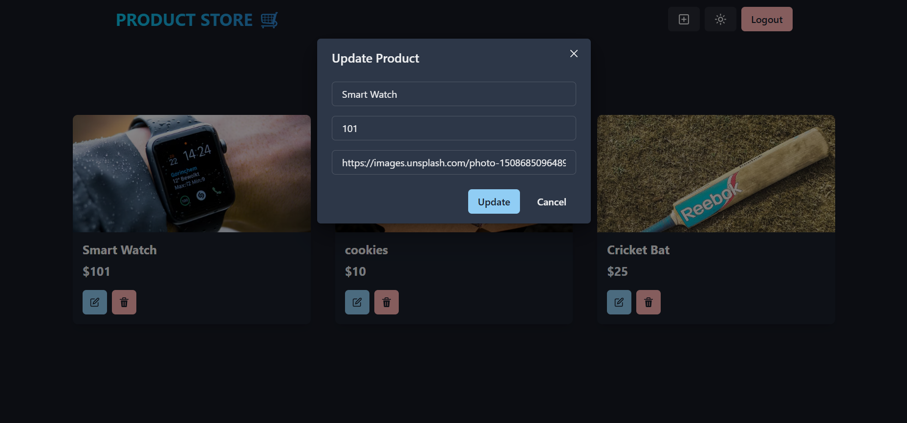

# 🛍️ Product Store App

A full-stack product management web application built with modern tools and clean UI.

## 🧩 Tech Stack

| Layer      | Tech                            |
|------------|---------------------------------|
| Frontend   | React, Vite, Chakra UI          |
| Backend    | Node.js, Express                |
| Auth       | JWT-based authentication        |
| Styling    | Chakra UI                       |
| State Mgmt | Zustand                         |
| DB         | MongoDB (via Mongoose)          |
| Package Manager | npm                        |

---

## 🚀 Features

- 🔐 **User Authentication** (Signup & Login using JWT)
- ➕ Create, view, update, and delete products
- 🧠 Zustand for state management
- 🎨 Responsive and theme-aware UI with Chakra UI
- 🔁 Proxy connection between frontend & backend via Vite
- ⚙️ MongoDB backend with API routing via Express

---

## 🔐 Auth Flow

- JWT token saved in `localStorage` after login/signup
- Protected routes using `ProtectedRoute` wrapper
- Navbar dynamically updates to show **Login / Signup** or **Logout**
- Product pages only accessible when logged in

---

## 📸 Screenshots

  
    
  
    
  
    
  

-
